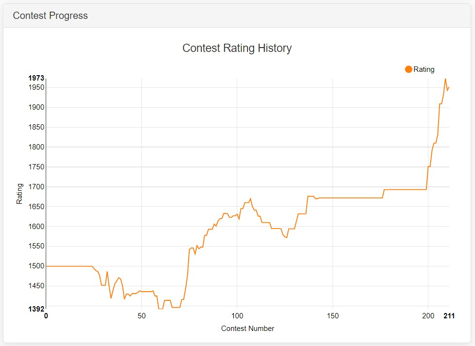

### Leetcode Contest Ranks

`78` Finished Contests

`1952` Rating

`2190 / 92554` Global Ranking

**last updated: April 25th, 2020**
- weekly-contest-186, `1559/11684` Top `13.34%` (YIKES)
- weekly-contest-185, `1246/14200`, Top `8.77%` (Excuse: I cut my hand making breakfast after biweekly-contest-24 and I had to do this injured)
- biweekly-contest-24, `2190/7729`, Top `28.33%` (YIKES)
- weekly-contest-184, `411/13663`, Top `3.00%`
- weekly-contest-183, `767/12542`, Top `6.12%`
- weekly-contest-182, `162/11694`, Top `1.39%`
- weekly-contest-181, `1117/10930`, Top `10.22%`
- weekly-contest-180, `1194/10047`, Top `11.88%`
- weekly-contest-179, `693/9847`, Top `7.04%`
- weekly-contest-178, `363/9210`, Top `3.94%`
- weekly-contest-162, `927/6058`, Top `15.3%`
- weekly-contest-141, `1224/4126`, Top `29.67%`
- weekly-contest-140, `694/4047`, Top `17.15%`
- weekly-contest-139, `1161/3985`, Top `29.13%`
- weekly-contest-137, `1369/4091`, Top `33.46%`
- weekly-contest-133, `472/4862`, Top `9.71%`
- weekly-contest-128, `988/5166`, Top `19.13%`
- weekly-contest-127, `1031/4735`, Top `21.77%`
- weekly-contest-123, `846/3714`, Top `22.78%`
- weekly-contest-122, `1342/3485`, Top `38.51%`
- weekly-contest-121, `1547/3924`, Top `39.42%`
- weekly-contest-120, `1861/3876`, Top `48.01%`
- weekly-contest-119, `1348/3848`, Top `35.03%`
- weekly-contest-114, `1421/3199`, Top `44.42%`
- weekly-contest-109, `1523/3386`, Top `44.98%`
- weekly-contest-107, `1556/3714`, Top `41.9%`
- weekly-contest-105, `1348/3528`, Top `38.21%`
- weekly-contest-104, `1570/3580`, Top `43.85%`
- weekly-contest-103, `847/4162`, Top `20.35%`
- weekly-contest-102, `1135/4387`, Top `25.87%`
- weekly-contest-100, `735/4008`, Top `18.34%`
- weekly-contest-98, `525/3552`, Top `14.78%`
- weekly-contest-97, `1285/3762`, Top `34.16%`
- weekly-contest-96, `979/4704`, Top `20.81%`
- weekly-contest-94, `918/4542`, Top `20.21%`
- weekly-contest-92, `1252/4508`, Top `27.77%`
- weekly-contest-91, `1007/4227`, Top `23.82%`
- weekly-contest-89, `625/3646`, Top `17.14%`
- weekly-contest-87, `706/3029`, Top `23.31%`
- weekly-contest-86, `514/2699`, Top `19.04%`
- weekly-contest-85, `827/2997`, Top `27.59%`
- weekly-contest-84, `584/3076`, Top `18.99%`
- weekly-contest-83, `827/2745`, Top `30.13%`
- weekly-contest-81, `578/2797`, Top `20.66%`
- weekly-contest-79, `391/2485`, Top `15.73%`
- weekly-contest-77, `836/2982`, Top `28.03%`
- weekly-contest-76, `865/2849`, Top `30.36%`
- weekly-contest-75, `614/2830`, Top `21.7%`
- weekly-contest-74, `1117/2675`, Top `41.76%`
- weekly-contest-72, `639/2382`, Top `26.83%`
- weekly-contest-71, `184/2475`, Top `7.43%`
- weekly-contest-70, `557/2555`, Top `21.8%`
- weekly-contest-69, `726/2573`, Top `28.22%`
- weekly-contest-67, `802/2865`, Top `27.99%`
- weekly-contest-by-app-academy, `1230/1999`, Top `61.53%`
- weekly-contest-58, `796/2514`, Top `31.66%`
- leetcode-weekly-contest-55, `1947/3037`, Top `64.11%`
- leetcode-weekly-contest-53, `1589/2934`, Top `54.16%`
- leetcode-weekly-contest-52, `1140/2615`, Top `43.59%`
- leetcode-weekly-contest-46, `1072/2389`, Top `44.87%`
- leetcode-weekly-contest-45, `963/2292`, Top `42.02%`
- leetcode-weekly-contest-44, `932/2272`, Top `41.02%`
- leetcode-weekly-contest-41, `921/2174`, Top `42.36%`
- leetcode-weekly-contest-40, `1027/2133`, Top `48.15%`
- leetcode-weekly-contest-38, `771/2034`, Top `37.91%`
- leetcode-weekly-contest-37, `1563/1999`, Top `78.19%`
- leetcode-weekly-contest-36, `1063/1985`, Top `53.55%`
- leetcode-weekly-contest-35, `772/1679`, Top `45.98%`
- leetcode-weekly-contest-34, `559/1557`, Top `35.9%`
- leetcode-weekly-contest-33, `611/1665`, Top `36.7%`
- leetcode-weekly-contest-32, `535/1744`, Top `30.68%`
- leetcode-weekly-contest-31, `518/1551`, Top `33.4%`
- leetcode-weekly-contest-30, `976/1517`, Top `64.34%`
- leetcode-weekly-contest-29, `1354/1663`, Top `81.42%`
- leetcode-weekly-contest-28, `397/1848`, Top `21.48%`
- leetcode-weekly-contest-25, `1050/1841`, Top `57.03%`
- leetcode-weekly-contest-24, `749/1930`, Top `38.81%`
- leetcode-weekly-contest-23, `770/1864`, Top `41.31%`
- leetcode-weekly-contest-22, `840/2046`, Top `41.06%`
- leetcode-weekly-contest-21, `788/1988`, Top `39.64%`

### Codeforces Contests

Contest rating: `1307`

https://codeforces.com/contests/with/recklessinkblot

- Education Codeforces Round 86 Div 2, Rank `10178`, Solved `1` (YIKES)
- Codeforces Round \#637 Div 2, Rank `8925`, Solved `1` (YIKES)
- Codeforces Round \#636 Div 3, Rank `3903`, Solved `3`
- Codeforces Round \#635 Div 2, Rank `4953`, Solved `2`
- Codeforces Round \#634 Div 3, Rank `2144`, Solved `4`
- Codeforces Round \#633 Div 2, Rank `7738`, Solved `2`
- Codeforces Round \#628 Div 2, Rank `3497`, Solved `3`
- Codeforces Round \#610 Div 2, Rank `4512`, Solved `1`
- Codeforces Round \#553 Div 2, Rank `3411`, Solved `1`
- Educational Codeforces Round 29 Div 2, Rank `4178`, Solved `1`
- Codeforces Round \#521, Rank `3802`, Solved `2`
- Lyft Level 5 Challenge 2018, Rank `2492`, Solved `2`
- Codeforces Round \#472 Div 2, Rank `1972`, Solved `1`
- Codeforces Round \#471 Div 2, Rank `1583`, Solved `1`
- Codeforces Round \#470 Div 2, Rank `2304`, Solved `1`

### Topcoder

User name:             `recklessinkblot`

Rating (highest):      `1156` (1156)

Rated events:          1

Last event:            Apr 28, 2020

Member since:          Apr 15, 2020

Country:               Canada

Coder type:            Professional

Default language:      Python
